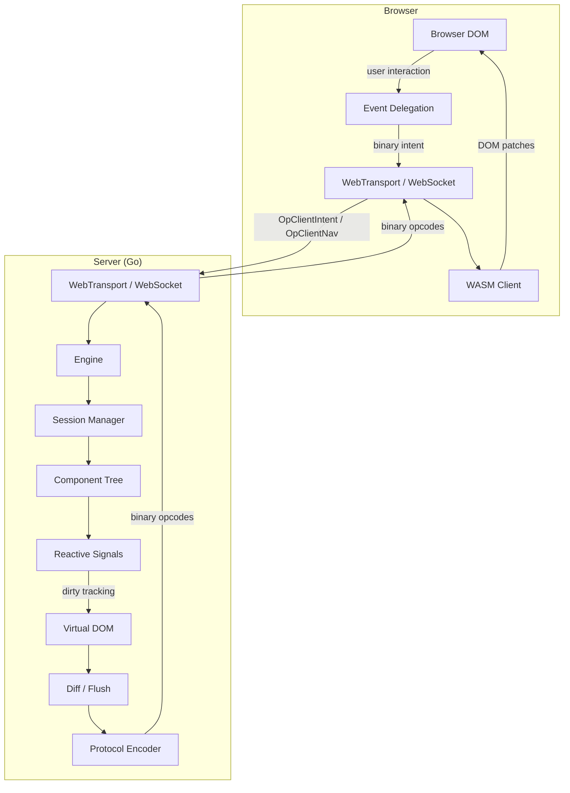
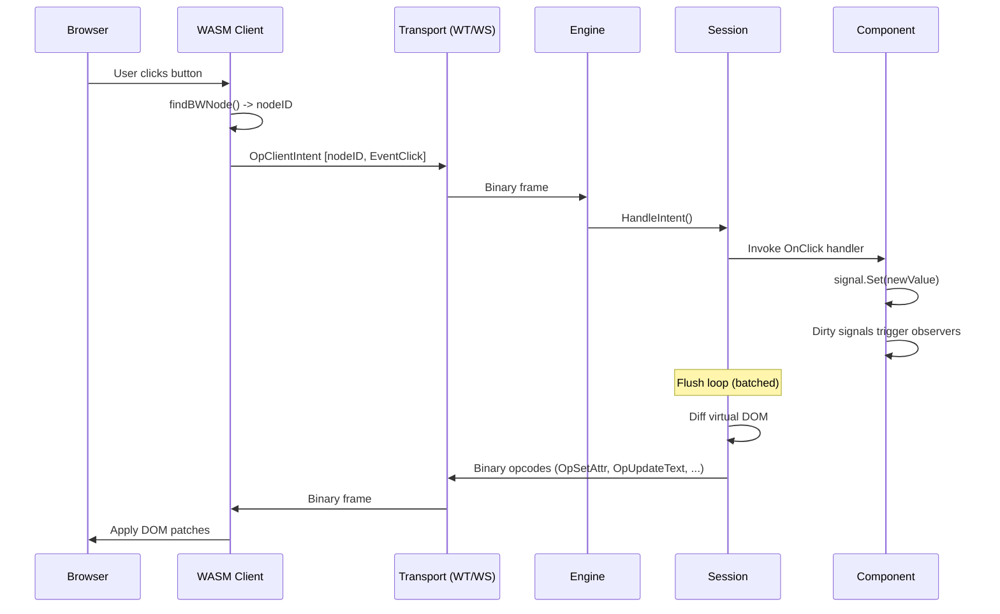
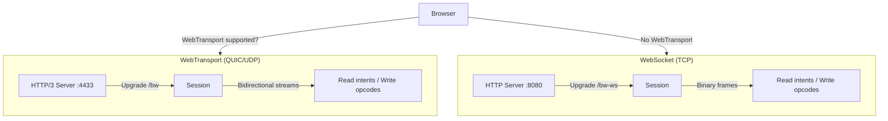
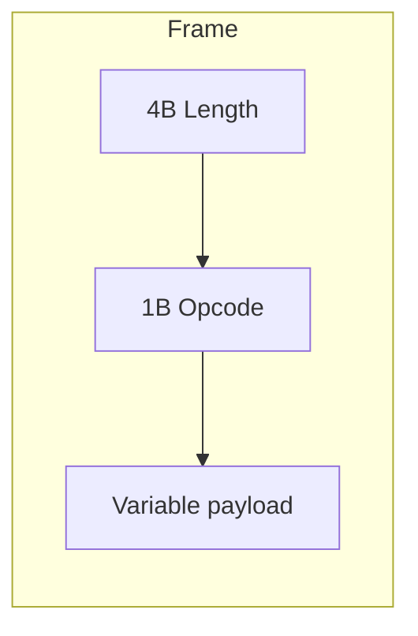
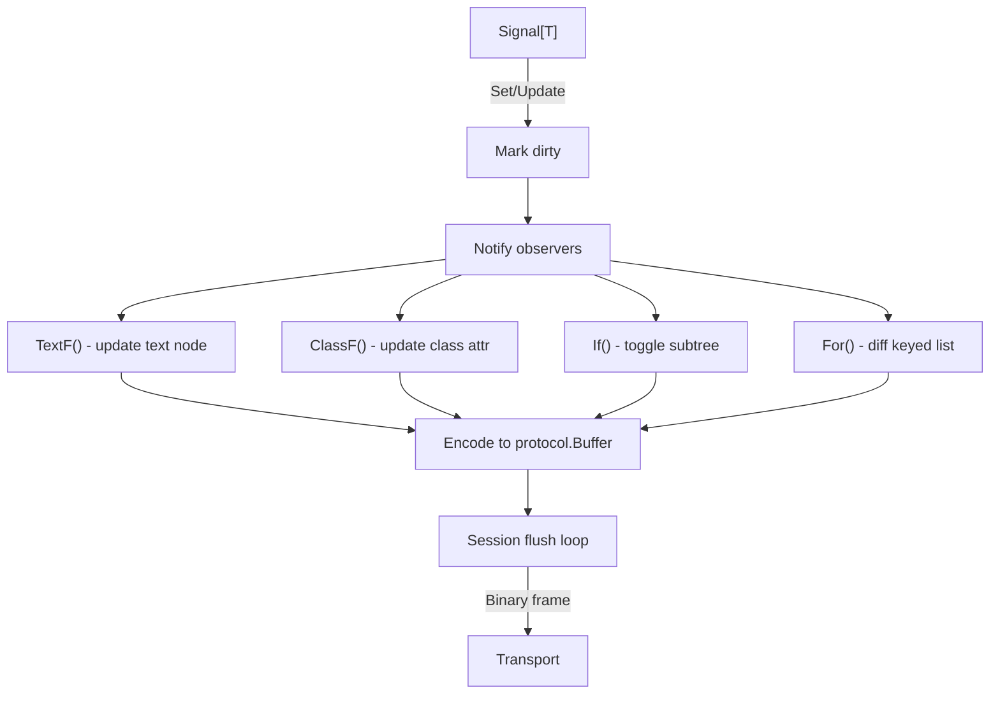
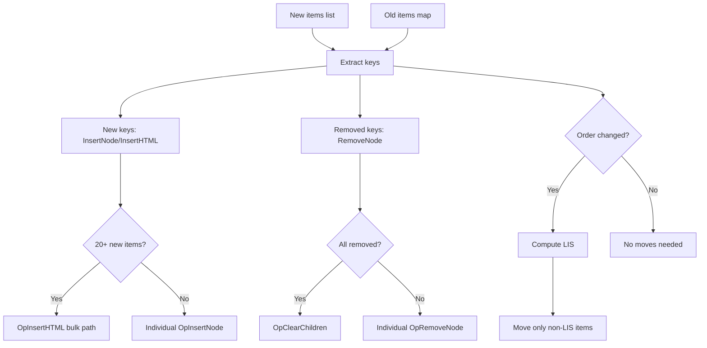
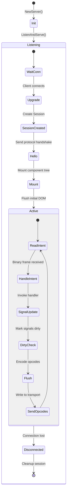
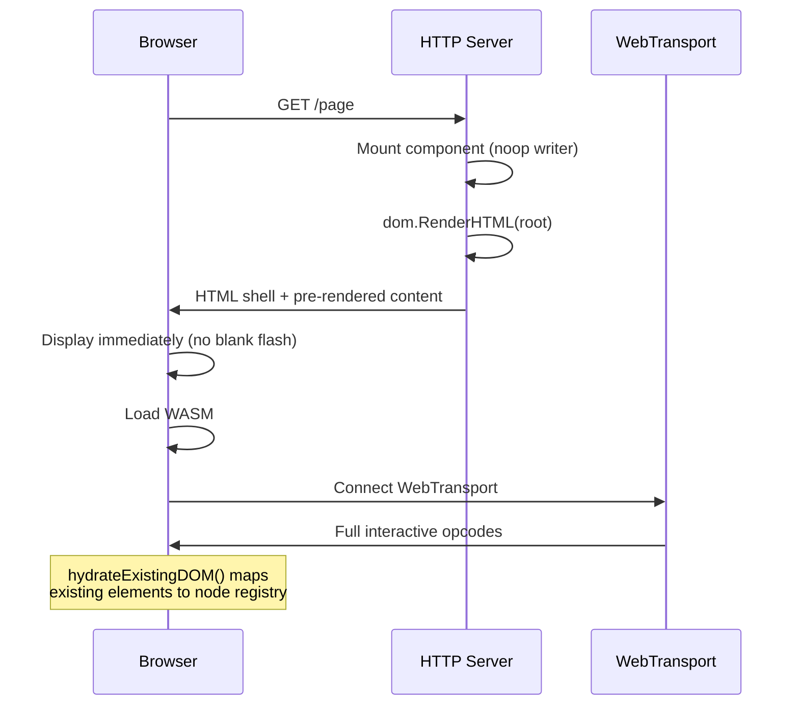
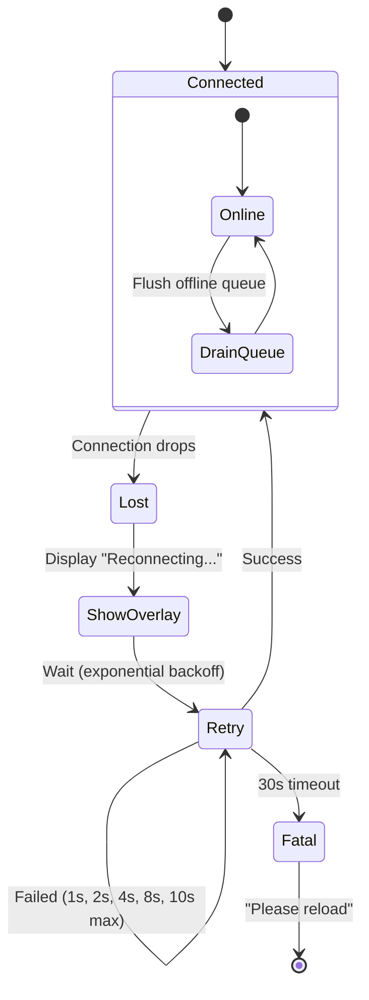
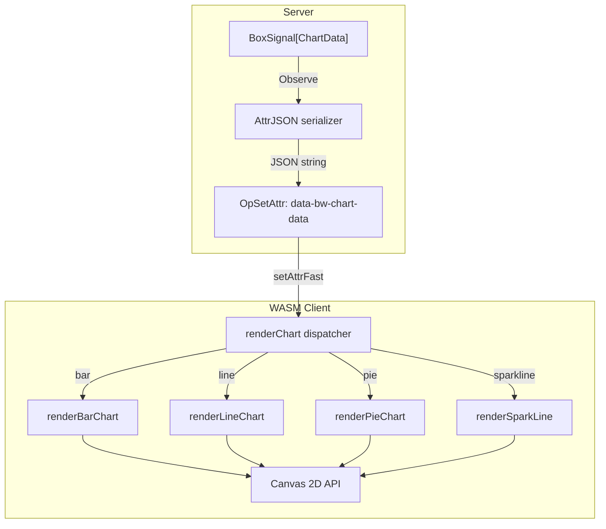

# Bytewire Architecture

## Overview

Bytewire is a server-driven UI framework. The server owns all state and logic; the browser runs a thin WASM client that patches the DOM. Communication uses a compact binary protocol over WebTransport (HTTP/3 + QUIC) with WebSocket fallback.

## System Architecture



## Request/Response Lifecycle



## Package Structure

```mermaid
graph LR
    subgraph Public API
        engine[engine]
        dom[dom]
        style[style]
        components[components]
        router[router]
    end

    subgraph Internal
        protocol[protocol]
        wasm[wasm]
        ratelimit[ratelimit]
        metrics[metrics]
        plugin[plugin]
        devcert[devcert]
        webauthn[webauthn]
    end

    engine --> dom
    engine --> protocol
    engine --> ratelimit
    engine --> metrics
    engine --> plugin
    engine --> devcert
    engine --> webauthn
    dom --> protocol
    components --> dom
    components --> style
    router --> engine
    wasm --> protocol
```

| Package | Purpose |
|---------|---------|
| `engine` | WebTransport/WebSocket server, session lifecycle, flush loop |
| `dom` | Virtual DOM nodes, signals, reactive primitives (`If`, `For`, `TextF`) |
| `protocol` | Binary opcode encoding/decoding, buffer pool |
| `wasm` | Browser WASM client: DOM patching, event delegation, transport |
| `style` | Type-safe Tailwind-style CSS utility classes |
| `components` | Reusable UI: forms, table, modal, badge, alert, spinner, charts |
| `router` | Server-side URL routing with `:param` extraction |
| `ratelimit` | Per-session token bucket rate limiter |
| `metrics` | Prometheus-compatible counter, gauge, histogram, registry |
| `plugin` | Lifecycle hooks (connect, mount, disconnect) |
| `devcert` | Auto-generated ephemeral TLS certificates for development |
| `webauthn` | Passkey/WebAuthn credential store and challenge flow |

## Transport Layer



- **WebTransport**: QUIC-based, multiplexed, no head-of-line blocking. Primary transport.
- **WebSocket**: TCP-based fallback. Server sets `TCP_NODELAY` to minimize Nagle buffering.
- Both transports use identical length-prefixed binary framing: `[4B length][payload]`.

## Binary Protocol

All DOM mutations are encoded as compact binary opcodes. Each frame is length-prefixed.



### Server -> Client Opcodes

| Opcode | Hex | Payload | Description |
|--------|-----|---------|-------------|
| UpdateText | `0x01` | nodeID + text | Set text content |
| SetAttr | `0x02` | nodeID + key + value | Set attribute (uses fast path for `id`, `class`) |
| RemoveAttr | `0x03` | nodeID + key | Remove attribute |
| InsertNode | `0x04` | nodeID + parentID + tag + attrs | Create element |
| RemoveNode | `0x05` | nodeID | Remove element from tree |
| ReplaceText | `0x06` | nodeID + offset + text | Surgical text splice |
| SetStyle | `0x07` | nodeID + prop + value | Set inline CSS property |
| PushHistory | `0x08` | URL path | Update browser URL via History API |
| Batch | `0x09` | nested opcodes | Atomic group applied together |
| Error | `0x0A` | message | Display error overlay |
| DevToolsState | `0x0B` | JSON snapshot | Session state for devtools |
| InsertText | `0x0E` | nodeID + parentID + text | Create text node with content (combined) |
| InsertHTML | `0x0F` | parentID + HTML string | Bulk HTML insert via template element |
| ClearChildren | `0x14` | parentID | Remove all children, bulk ID cleanup |
| SwapNodes | `0x15` | nodeA + nodeB | Swap two DOM nodes (optimized 2-element swap) |
| BatchText | `0x16` | count + [nodeID + text]... | Batched text updates in single frame |

### Client -> Server Opcodes

| Opcode | Hex | Payload | Description |
|--------|-----|---------|-------------|
| ClientIntent | `0x10` | nodeID + eventType + data | User event (click, input, submit) |
| ClientNav | `0x11` | URL path | Browser navigation (popstate, link click) |
| ClientAuth | `0x13` | credential data | WebAuthn response |

## Reactive System



### Signal Types

- **`Signal[T]`** -- Single value. `Set()`, `Update()`, `Get()`. Observers fire on change.
- **`ListSignal[T]`** -- Ordered collection. `Append()`, `Remove()`, `Clear()`. Used with `For()`.
- **`Computed[T]`** -- Derived value from other signals. Read-only.

### List Diffing (`For()`)

The `For()` primitive uses keyed reconciliation with LIS (Longest Increasing Subsequence) optimization:



## WASM Client

The browser-side WASM client is ~50KB and handles:

1. **Transport connection** -- WebTransport with WebSocket fallback, auto-reconnect with exponential backoff
2. **DOM patching** -- Applies binary opcodes directly to the DOM via `syscall/js`
3. **Event delegation** -- Single listener on `#bw-root` for click, input, submit
4. **Node registry** -- `map[uint32]js.Value` maps server-assigned IDs to DOM elements
5. **SPA routing** -- Intercepts `<a>` clicks with local hrefs, sends `OpClientNav`

### Performance Optimizations

- **`__bwId` JS property** on elements instead of `data-bw-id` attribute (avoids `getAttribute` overhead)
- **`setAttrFast`** uses direct property assignment for `id`, `class`, `className` instead of `setAttribute`
- **`__bwProcessHTML`** JS helper for bulk insert: parses HTML via `<template>`, collects IDs in a single JS loop
- **`__bwCollectIds`** JS helper for bulk removal: collects all descendant IDs as packed `Uint8Array`
- **`data-bw-tid`** proxy: parent element holds text node reference, avoiding wrapper elements

## Server Engine Lifecycle



## SSR (Server-Side Rendering)

When enabled with `WithSSR()`, the initial HTTP response includes pre-rendered HTML:



## Reconnection



The WASM client queues events during disconnection (persisted to `sessionStorage`) and drains them on reconnect.

## Chart Rendering (Hybrid Canvas)

Charts use a hybrid server-client architecture that rides on existing opcodes:



**No new opcodes needed.** The server creates `<canvas>` elements with:
- `data-bw-chart` — chart type (bar, line, pie, sparkline)
- `data-bw-chart-data` — JSON-serialized data from a `BoxSignal`

When the signal changes, `AttrJSON` marshals the new data and sets it as a dirty attribute. The engine emits a standard `OpSetAttr`. The WASM client's `setAttrFast` intercepts `data-bw-chart-data` changes and calls `renderChart()`, which dispatches to the appropriate Canvas 2D renderer.

### Signal Types (Updated)

- **`Signal[T comparable]`** — Single comparable value. Deduplicates on `==`.
- **`BoxSignal[T any]`** — Single non-comparable value (e.g., structs with slices). Always notifies on Set.
- **`ListSignal[T any]`** — Ordered collection for use with `For()`.
- **`Computed[T]`** — Derived read-only value.

### Prefetch Warmup

On hover over SPA links (`<a data-bw-link>`), the WASM client sends an `OpClientIntent` with `EventMouseEnter`. The server's session handler detects this and calls `PrefetchRoute()`, which warms the Go runtime for that route path. This reduces navigation latency by pre-allocating memory and warming caches ahead of the actual click.
