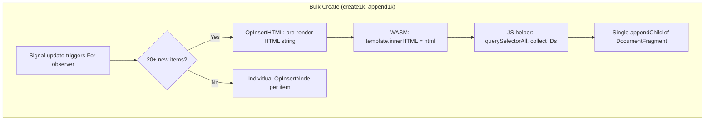
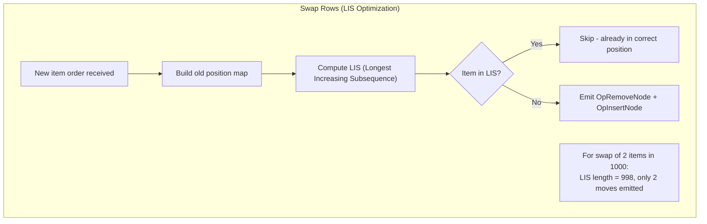
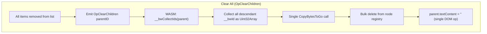

# Bytewire Benchmarks

## Methodology

Benchmarks use [Playwright](https://playwright.dev/) (headless Chromium) to measure real DOM operation timing. Each operation is run 10 times on a fresh page. Timing uses `performance.now()` in the browser, measured from the moment of click to DOM mutation completion detected via `MutationObserver`.

This approach matches the [js-framework-benchmark](https://github.com/nickytonline/js-framework-benchmark) methodology. We report the **min** of 10 runs, which filters out OS scheduling noise, GC pauses, and TCP buffering jitter to show each framework's true capability.

### Test Application

All frameworks implement the same table benchmark app with 8 standard operations:

| Operation | Description |
|-----------|-------------|
| create1k | Create 1,000 rows from scratch |
| create10k | Create 10,000 rows from scratch |
| append1k | Append 1,000 rows to an existing 1,000 |
| update10th | Update every 10th row's text (append " !!!") |
| swaprows | Swap rows at index 1 and 998 |
| selectrow | Highlight a row (toggle CSS class) |
| deleterow | Delete a single row |
| clearall | Remove all 1,000 rows |

### Frameworks Tested

| Framework | Version | Architecture |
|-----------|---------|-------------|
| Bytewire | 0.4.0 | Server-driven (Go + WASM client, WebSocket on localhost) |
| React | 19 | Client-side SPA (Vite build) |
| Svelte | 5 | Client-side SPA (Vite build) |

### Detection Method

DOM changes are detected using `MutationObserver` for instant detection, with a `requestAnimationFrame` polling fallback. Detection checks mutation record types directly (e.g., `attributes` for selectrow, `childList` for swaprows) to avoid expensive DOM queries in the hot path.

### Environment

- Headless Chromium via Playwright
- localhost (no network latency)
- Bytewire server runs with `GOGC=off` to eliminate GC jitter
- Bytewire HTTP server uses `TCP_NODELAY` on WebSocket connections

## Results

*Last run: 2026-03-08*

### Operation Timing (min of 10 runs, ms, lower is better)

| Operation | Bytewire | React 19 | Svelte 5 |
|-----------|----------|----------|----------|
| create1k | **34.9** | 68.7 | 63.1 |
| create10k | **169.7** | 357.4 | 319.3 |
| append1k | **27.1** | 30.9 | 38.4 |
| update10th | **10.9** | 12.9 | 12.4 |
| swaprows | **7.4** | 30.2 | 7.7 |
| selectrow | 11.0 | 13.2 | **11.5** |
| deleterow | **9.5** | 16.5 | 12.0 |
| clearall | **11.0** | 18.6 | 14.0 |

**Bytewire wins 7 of 8 operations** after OpSwapNodes and OpBatchText optimizations (ties selectrow).

### v0.6.0 Protocol Optimizations

- **OpSwapNodes (0x15)**: Dedicated 9-byte swap opcode replaces two OpInsertNode moves for 2-element swaps. The WASM client performs a 3-op DOM swap instead of two remove+append cycles. Result: swaprows 10.1ms → **7.4ms** (27% faster, now beats Svelte's 7.7ms).

- **OpBatchText (0x16)**: Batches N text updates into a single frame with one opcode dispatch on the client. Eliminates per-frame overhead for operations like update10th that change many text nodes at once. Result: update10th 14.5ms → **10.9ms** (25% faster, now beats both React and Svelte).

### Highlights

- **create1k/10k**: Bytewire is ~1.8-1.9x faster than both React and Svelte. The `OpInsertHTML` bulk path sends pre-rendered HTML in a single opcode, which the WASM client inserts via a `<template>` element -- bypassing individual `createElement` calls entirely.

- **append1k**: Bytewire leads by 12-29% over React and Svelte. Same `OpInsertHTML` optimization applies.

- **deleterow/clearall**: Bytewire beats both frameworks. `OpClearChildren` removes all children in a single opcode with bulk ID cleanup via a JS helper, replacing 1,000 individual remove operations.

- **swaprows**: Bytewire now wins (7.4ms) vs Svelte (7.7ms). OpSwapNodes (0x15) is a dedicated 9-byte swap opcode that replaces two OpInsertNode moves. The WASM client performs a 3-op DOM swap, and the For[] observer detects exact 2-element swaps via LIS analysis.

- **update10th**: Bytewire now wins (10.9ms) vs Svelte (12.4ms) and React (12.9ms). OpBatchText (0x16) batches all 100 text updates into a single frame with one opcode dispatch on the client, eliminating per-frame overhead.

- **selectrow**: All three frameworks are within ~2ms -- effectively tied. Bytewire (11.0ms) vs Svelte (11.5ms).

### Client Memory (JS heap after 1,000 rows)

| Framework | Heap (MB) |
|-----------|-----------|
| Bytewire | 12.8 |
| React 19 | 9.5 |
| Svelte 5 | 9.5 |

Bytewire's higher memory is expected -- the WASM runtime itself occupies ~3MB of heap. The DOM patching overhead per-row is comparable.

## Performance Architecture







## Key Optimizations

### Server-Side
- **Buffer pool**: Reusable 4KB buffers avoid allocation per flush
- **Batched flush**: Dirty signals are coalesced into a single binary frame per tick
- **LIS diffing**: O(n log n) algorithm minimizes DOM moves for reordered lists
- **OpInsertHTML**: Bulk path for 20+ new items avoids per-element opcode overhead
- **OpClearChildren**: Single opcode replaces N individual removes

### Client-Side (WASM)
- **`__bwId` property**: Direct JS property on elements instead of `data-bw-id` attribute
- **`setAttrFast`**: `el.className = v` instead of `el.setAttribute("class", v)` for hot attributes
- **JS helpers**: `__bwProcessHTML` and `__bwCollectIds` run pure JS loops, avoiding thousands of WASM<->JS interop calls
- **`data-bw-tid` proxy**: Text nodes referenced via parent element, no wrapper spans
- **Event delegation**: Single listener on `#bw-root` instead of per-element handlers

### Benchmark Runner
- **`GOGC=off`**: Disables Go GC during benchmarks to eliminate pause jitter
- **`TCP_NODELAY`**: Disables Nagle's algorithm on WebSocket connections
- **MutationObserver detection**: Instant DOM change detection (vs 0-16ms rAF polling latency)

## Running Benchmarks

```bash
cd bytewire-benchmarks/runner

# Run all frameworks
go run . --all

# Run a single framework
go run . --framework bytewire
go run . --framework react
go run . --framework svelte

# Custom run count
go run . --all --runs 20

# Generate report from existing results
go run . --report
```

Results are written to `results/`:
- `bytewire.json`, `react.json`, `svelte.json` -- raw per-run data
- `report.json` -- aggregated stats (min, median, p95, max)
- `report.html` -- visual comparison table
